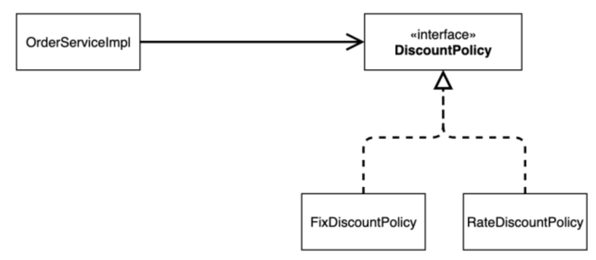

## OOP (Object Oriented Programming)

---

### OOP 가 필요한 이유

절차적 프로그래밍이 가지는 불편함을 해결하고자 등장

절차 지향적 언어로 작성했다고 가정해보자!
```javascript

var 민섭이_얼굴 = "김민섭";
 
function 이름으로_민섭이_얼굴_바꾸기 (이름){
    민섭이_얼굴 = 이름;
}
```
절차 지향적 언어는 해당 개념과 비슷한 자료형과 개념의 함수를 새로 구현해야하는 불편함이 있다.
```javascript
var 석주_얼굴 = "김석주";
 
function 이름으로_석주_얼굴_바꾸기 (이름){
    석주_얼굴 = 이름;
}

var 준홍이_얼굴 = "박준홍";

function 이름으로_준홍이_얼굴_바꾸기 (이름){
    준홍이_얼굴 = 이름;
}

```

객체 지향적으로 프로그래밍하게 된다면 객체 간의 독립성이 생기고 중복코드의 양이 줄어든다.

### OOP 특징

#### 1. 추상화(Abstraction)

필요로 하는 속성이나 행동을 추출하는 작업

- 민섭이_얼굴, 석주_얼굴, 준홍이_얼굴 모두 얼굴이라는 비슷한 개념이 있다.
- 얼굴이라는 하나의 집합으로 추상화하면 중복코드를 줄일 수 있다.

```java
public class 얼굴{
    String 얼굴;
    
    void 얼굴바꾸기(String 이름){
        this.얼굴 = 이름;
    }
}
```

#### 2. 캡슐화(Encapsulation)

낮은 결합도를 유지할 수 있도록 설계하는 것
- 정보를 은닉하여 외부에서 필요없는 것에는 접근하지 못하도록 막는 것


정보 은닉이 없이 프로그래밍을 했다고 생각해보자.

```java
public class Member{
    public String name;
    
    Member(){
        this.name = "name";
    }
}
```

이때 사용자의 이름을 인코딩 한다고 했을 때 다음 과 같이 구현하면 어떻게 될까?
```java
public class Main{
    public static void main(String[] args) {
        Member member = new Member();
        member.name = member.name+"encodesalt";
    }
}
```
만약 인코딩 방식이 바뀐다면 Main class를 다시 수정해야 한다.
```java
public class Main{
    public static void main(String[] args) {
        Member member = new Member();
        member.name = member.name+"eeeeencodesalttttttt";
    }
}
```

하지만 정보를 은닉하여 다음과 같이 설계하면 Main class 를 수정하지 않아도 된다.

```java
public class Member{
    private String name;
    
    Member(){
        this.name = "name";
    }
    
    encodeName(){
        this.name = this.name + "salt";
    }
}
```

```java
public class Main{
    public static void main(String[] args) {
        Member member = new Member();
        member.name = member.encodeName();
    }
}
```

#### 3. 상속성(Abstraction)

일반화 관계(Generalization)라고도 하며, 여러 개체들이 지닌 공통된 특성을 부각시켜 하나의 개념이나 법칙으로 성립하는 과정

- 일반화(상속)은 또 다른 캡슐화
- 자식 클래스를 외부로부터 은닉하는 캡슐화의 일종
- 상위 클래스의 변경이 어렵다는 단점도 있음

#### 4. 다형성(Polymorphism)
부모 클래스의 메소드를 자식 클래스가 오버라이딩해서 자신의 역할에 맞게 활용하는 것
- 상속 관계에 있으면, 새로운 자식 클래스가 추가되어도 부모 클래스의 함수를 참조하면 되므로 다른 클래스에 영향을 주지 않음


## OOP를 잘 설계하는 방법

---

### Design Smells

#### Rigidity(경직성)
- 시스템이 변경하기 어려움
- 하나의 변경을 위해서 다른 것들을 변경 해야할 때 경직성이 높음 

#### Fragility(취약성)
- 취약성이 높다면 시스템은 어떤 부분을 수정하였는데 관련이 없는 다른 부분에 영향을 줌
- 수정사항이 관련되지 않은 부분에도 영향을 끼치기 떄문에 관리하는 비용이 커짐

#### Immobility(부동성)
- 부동성이 높다면 재사용하기 위해서 시스템을 분리해서 컴포넌트를 만드는 것이 어려움

#### Viscosity(점착성)
- 점착성은 개발환경이 느리고 효율적이지 못할 때 나타난다.
- 예를들면 컴파일 시간이 매우 길다면 큰 규모의 수정이 필요하더라도 개발자는 recompile 시간이 길기 때문에 작은 규모의 수정으로 문제를 해결할려고 할 것이다.


### SOLID

아름다운 객체 지향 설계를 위한 방법

#### Interface Segregation Principle(ISP)
사용하지 않는 메소드에 의존하면 안된다.

#### Single Responsibility Principle(SRP)
클래스는 오직 하나의 이유로 수정이 되어야 한다는 것을 의미한다.

#### Liskov Substitution Principle(LSP)
base 클래스에서 파생된 클래스는 base 클래스를 대체해서 사용할 수 있어야한다.

#### Open Closed Principle(OCP)
자신의 확장에는 열려있고 주변의 변화에는 닫혀 있어야 하는 것을 의미한다.

#### Dependency Inversion Principle(DIP)
자신(high level module)보다 변하기 쉬운 모듈(low level modeul)에 의존해서는 안된다.



## 예상 면접 질문

Q1
```text
Q1-1. OOP가 중요한 이유는 무엇인가요?

Q1-2. Java를 주언어로 사용하는 이유는 무엇인가요?

Q1-3. (코드를 보며) 다음과 같이 작성한 이유가 무엇인가요?
```

Q2
```text
Q2-1. OOP의 상속을 활용했을 때 생기는 단점은 없나요?

Q2-2. 그 단점을 해결하기 위한 방법은 무엇이 있을까요?
```

Q3
```text
Q3-1. (코드를 보며) 다음과 같이 코드를 작성했을 때 아쉬운 점이 있을까요?

Q3-2. 어떤 식으로 개선하면 좋을까요?
```

Q4
```text
Q4-1. Spring을 사용하는 이유가 무엇인가요?

Q4-2. 본인의 Spring 이해도는 어느 정도라고 생각하시나요?
```

Q5
```text
Q5-1. 객체 지향 언어를 잘 사용할 수 있는 방법은 무엇일까요?

Q5-2. 그렇다면 SOLID를 적용해 프로젝트를 진행해보신 적이 있으신ㄴㄴ가요?

Q5-3. 그렇다면 그 중 가장 어려웠던 점은 무엇인가요?
```